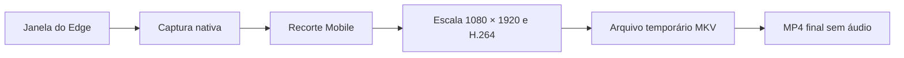

# Plano de desenvolvimento — Captura Mobile do Yourots

Data: 1 de outubro de 2026.
Status: implementação iniciada; Fase 1 validada tecnicamente em 01/10/2026.

## 1. Objetivo

Desenvolver uma ferramenta externa para Windows x64 que grave exatamente a área Mobile da aba `https://yourots.online/#/jogar`, incluindo a interface completa do jogo, e gere um vídeo vertical para publicação em Reels.

A ferramenta deverá permitir iniciar, pausar e finalizar gravações quando o usuário desejar, com prévia do enquadramento e atalhos configuráveis.

## 2. Requisitos definidos

| Item | Definição |
| --- | --- |
| Navegador inicial | Microsoft Edge já aberto pelo usuário |
| Área Mobile configurada | 486 × 864 pixels CSS |
| Proporção | 9:16 exato: `486 × 16 = 864 × 9` |
| Prévia do DevTools | 100% como configuração inicial |
| Vídeo final | 1080 × 1920 pixels |
| Formato final | MP4 com H.264 |
| Taxa de quadros | 30 FPS por padrão; 60 FPS opcional após validação |
| Áudio | Nenhuma faixa de áudio |
| Enquadramento | Toda a área Mobile, sem corte do conteúdo, distorção ou margens adicionadas |
| Plataforma | Windows x64, com validação inicial no Windows 10 instalado |
| Destino | Pasta local escolhida pelo usuário |

A transformação de 486 × 864 para 1080 × 1920 usa o mesmo fator de escala nos dois eixos: `20/9`. A ampliação preserva a proporção, mas não cria detalhes adicionais na imagem original.

### Ambiente observado

- Windows 10 Pro, build 19045.
- GPU NVIDIA GeForce RTX 5060.
- Dois monitores de 1920 × 1080.
- Edge aberto no segundo monitor, com o jogo e o Console lado a lado.
- Área Mobile configurada em 486 × 864 e prévia em 100%.
- DPI observado da janela do Edge: 96, correspondente a 100%.
- Visual Studio 2022 com ferramentas C++ e CMake disponíveis.
- FFmpeg e FFprobe não foram encontrados no PATH durante a inspeção; deverão acompanhar a ferramenta.

Na inspeção, a área Mobile ultrapassava um pouco o limite inferior disponível do navegador. Antes da primeira gravação, será necessário liberar espaço e confirmar a visibilidade integral. Ocultar a barra de favoritos é a primeira alternativa a validar, preservando a prévia a 100%.

## 3. Escopo da primeira versão

### Funcionalidades previstas

- Selecionar a janela do Edge usada para jogar.
- Selecionar o retângulo Mobile com proporção travada em 9:16.
- Mostrar uma prévia correspondente ao conteúdo que será gravado.
- Gravar toda a área Mobile, incluindo cabeçalho, mapa, habilidades e menus inferiores.
- Iniciar, pausar, retomar e finalizar por botões ou atalhos configuráveis.
- Exportar automaticamente para MP4, sem áudio.
- Salvar preferências de qualidade, pasta e enquadramento.
- Exibir duração, estado da gravação e erros que impeçam a captura.
- Tratar fechamento, minimização, mudança de tamanho e falhas de escrita.

### Limite de captura da primeira versão

A captura nativa seleciona uma **janela**, não a identidade de uma aba. A aba do jogo deverá permanecer ativa nessa janela durante a gravação. Recomenda-se uma janela dedicada contendo somente o jogo.

Movimentar essa janela não deverá deslocar o recorte. Alterar seu tamanho, a disposição do DevTools, o zoom ou a escala do monitor poderá exigir nova calibração.

Capturar exclusivamente uma aba enquanto outras abas são usadas, detectar sua URL com garantia e gravar conteúdo fora da área renderizada exigiriam integração adicional com o navegador. Esses recursos ficam fora da primeira versão.

Não fazem parte deste escopo: áudio, microfone, edição de vídeo, legendas, publicação automática no Instagram ou modificação do jogo.

## 4. Tecnologia e arquitetura

| Componente | Tecnologia | Responsabilidade |
| --- | --- | --- |
| Aplicativo | C++20 e Win32 | Interface, atalhos, configuração e controle da sessão |
| Captura | Windows.Graphics.Capture via C++/WinRT | Receber os quadros da janela selecionada |
| Processamento inicial | Direct3D 11 | Copiar o retângulo Mobile e alimentar a prévia |
| Gravação e exportação | FFmpeg | Ampliação, conversão de cores, codificação e contêineres |
| Codificação preferencial | H.264 NVENC | Usar o encoder de hardware da RTX 5060 |
| Alternativa de codificação | H.264 por CPU | Permitir gravação quando NVENC não estiver disponível |
| Verificação dos arquivos | FFprobe | Conferir dimensões, codecs, duração, proporção e ausência de áudio |
| Build | CMake e MSVC x64 | Compilar e empacotar a aplicação |

C++ foi escolhido pela integração direta com as APIs nativas de captura e Direct3D, considerando o destino exclusivo em Windows x64. O FFmpeg será distribuído com versão fixa, configuração conhecida e os avisos de licença correspondentes.

### Implementação inicial do fluxo

1. Receber uma textura da janela pela API de captura.
2. Copiar somente a região Mobile para uma textura própria, respeitando o tamanho válido do quadro.
3. Na primeira versão, transferir o recorte para memória da CPU e enviar quadros BGRA ao FFmpeg por pipe. Tratar corretamente o espaçamento entre linhas da textura.
4. Ampliar para 1080 × 1920, converter as cores e codificar em H.264.
5. Gravar em MKV temporário e, ao finalizar, remultiplexar para MP4 sem recodificar.

O uso de NVENC acelera a codificação. Esse desenho inicial não pressupõe que todo o fluxo permaneça na GPU. Uma integração que evite a transferência para a CPU só deverá ser acrescentada se os testes demonstrarem necessidade.

### Organização prevista dos módulos

- `WindowSource`: seleção, identificação e acompanhamento da janela.
- `CaptureSession`: dispositivo Direct3D, captura e ciclo de vida dos quadros.
- `CropCalibration`: seleção, coordenadas, DPI e validação do enquadramento.
- `Preview`: apresentação da região selecionada.
- `Recorder`: cadência de quadros, pausa, buffers e comunicação com FFmpeg.
- `Export`: finalização, MP4 e verificação com FFprobe.
- `Settings`: preferências e pasta de saída.
- `Application`: interface, atalhos e estados da sessão.

## 5. Fases de desenvolvimento

### Fase 0 — Preparação e enquadramento

**Objetivo:** garantir que a fonte esteja inteira e definir as dependências de desenvolvimento.

- [x] Inspecionar navegador, sistema operacional, GPU e monitores.
- [x] Confirmar a configuração Mobile de 486 × 864 e a opção sem áudio.
- [x] Confirmar a disponibilidade das ferramentas C++ e CMake.
- [ ] Liberar espaço vertical no navegador e verificar as quatro extremidades do Mobile a 100%.
- [ ] Registrar uma imagem de referência da área completa.
- [x] Criar o projeto CMake x64 e definir Windows SDK e dependências.
- [x] Selecionar versões de FFmpeg e FFprobe com suporte ao encoder escolhido.

**Andamento em 01/10/2026:** o projeto CMake foi criado e compilado em Debug e Release x64 com Visual Studio 2022, MSVC 14.44 e Windows SDK 10.0.26100.0. FFmpeg/FFprobe 9.0.2 Essentials x64 foram fixados por checksum e instalados em `third_party/ffmpeg`. O build inclui `h264_nvenc`, porém o teste real mostrou que o driver NVIDIA 596.49 expõe NVENC API 13.0, enquanto essa build exige API 13.1/driver 610.00 ou superior. O fallback H.264 por CPU com `libx264` foi validado gerando MP4 de 1080 × 1920, 30 FPS, `yuv420p`, 1 segundo e sem áudio. A inspeção por UI Automation confirmou que a barra de favoritos do Edge continua visível e ocupa 32 px de altura. A automação usada para ocultá-la foi bloqueada pelo ambiente, portanto a validação visual das quatro extremidades e a imagem de referência continuam pendentes até que essa barra seja ocultada no navegador.

**Testes automatizados:** a base possui 14 testes unitários para integridade/instalação do pacote e escolha do encoder, além de um E2E da inicialização Win32 e do fluxo externo BGRA → MKV → MP4 com quadros sintéticos. A suíte verifica 1080 × 1920, H.264, 30 FPS, BT.709, 60 quadros em 2 segundos, ausência de áudio, `faststart`, decodificação, quatro cantos e movimento. Execução e relatórios: [tests/README.md](tests/README.md). Esses testes não concluem a validação visual do Mobile nem a captura nativa, ainda pendentes nas respectivas fases.

**Entrega:** projeto compilável e enquadramento de referência.

**Critério de conclusão:** a área Mobile está integralmente renderizada dentro do navegador e as dependências estão identificadas.

### Fase 1 — Prova de conceito de captura

**Objetivo:** demonstrar que a captura nativa funciona no Edge e no Windows atuais.

- [x] Verificar suporte a Windows.Graphics.Capture na execução.
- [x] Selecionar a janela e criar a sessão de captura.
- [x] Implementar o recebimento de quadros fora da thread da interface.
- [x] Fazer seleção manual da região Mobile e produzir uma imagem do recorte.
- [x] Testar a captura com outra aplicação sobreposta ao navegador.
- [x] Verificar efeitos da borda de indicação de captura do Windows.
- [x] Produzir uma gravação curta para validar o fluxo até o encoder.

**Validação em 01/10/2026:** foi criado o executável independente
`YourotsCapturePoc`, mantendo a prova técnica separada da interface prevista
para a Fase 2. No Windows 10 atual, `GraphicsCaptureSession::IsSupported()`
retornou verdadeiro e a janela do Edge foi capturada por `HWND` através de
`IGraphicsCaptureItemInterop`. O recebimento usa
`Direct3D11CaptureFramePool::CreateFreeThreaded`, portanto não depende da thread
da interface.

O quadro nativo da janela foi recebido em 1920 × 1040. Pela imagem completa foi
selecionado manualmente o retângulo físico `X=410, Y=176, W=486, H=864`. O PNG
resultante mostra as quatro extremidades do Mobile, sem Console, barra de
endereços, sombra externa ou barra de tarefas. O recorte foi salvo em
`artifacts/phase1/mobile.png`.

Para validar oclusão, a POC colocou uma janela magenta de 240 × 240 sobre o Edge
durante a sessão. O quadro capturado nessa condição teve zero pixels magenta e
foi salvo em `artifacts/phase1/mobile-overlay-probe.png`, confirmando que a
janela sobreposta não é incorporada à textura capturada por janela.

No Windows 10 atual, a propriedade `GraphicsCaptureSession.IsBorderRequired`
não está disponível em tempo de execução. A borda amarela de indicação do
Windows foi observada na área de trabalho durante a captura e registrada em
`artifacts/phase1/desktop-during-capture.png`; ela não aparece no recorte nem no
vídeo produzido pela sessão.

A gravação experimental enviou 900 quadros BGRA ao FFmpeg em 30 FPS, repetindo
o último quadro disponível quando necessário. O arquivo
`artifacts/phase1/phase1-30s.mp4` foi validado com FFprobe: H.264, 1080 × 1920,
`yuv420p`, 30 FPS, duração de 30,000 s e somente um stream de vídeo, sem faixa de
áudio. Um quadro aos 15 s foi extraído para
`artifacts/phase1/phase1-30s-frame15.png` e mantém o enquadramento integral.

Limitação confirmada para esta POC: o recorte `410,176,486,864` é a calibração
do layout, tamanho de janela e DPI atuais. Mudanças de tamanho, disposição do
DevTools, zoom ou escala exigem nova calibração, que será tratada na Fase 2.

**Testes automatizados em 01/10/2026:** após autorização para criar e executar
os testes, a suíte passou em Release e Debug x64, com quatro de quatro entradas
CTest aprovadas em cada configuração. São 64 testes unitários: 50 do núcleo
de captura e 14 das dependências. Os dois E2E cobrem a Fase 0 e a captura nativa
da Fase 1. O novo E2E tem nove grupos de cenários com janela Win32 controlada:
seis ciclos de início/encerramento, quatro cantos do recorte, callback em outra
thread, sobreposição visível excluída, movimento, fonte estática, falhas do
encoder, fechamento/redimensionamento da fonte e entradas inválidas. A janela
controlada permite conferir pixels sem depender do estado do jogo.

A validação levou a corrigir o parsing de recorte/duração, proteger o ciclo
de vida dos callbacks, propagar falhas da captura durante a gravação e declarar
pixels quadrados e BT.709 no vídeo. O E2E conferiu H.264, 1080 × 1920, 9:16,
30 FPS, `yuv420p`, BT.709, `faststart`, decodificação, movimento e ausência de
áudio. Vídeos de três segundos/90 quadros e dois segundos/60 quadros validaram
as fontes animada e estática. Relatórios e comandos de execução:
[tests/README.md](tests/README.md). Nenhum processo de captura ou FFmpeg dos
testes permaneceu em execução após a suíte.

**Entrega:** imagem de referência capturada e vídeo experimental de aproximadamente 30 segundos.

**Critério de conclusão:** todas as extremidades do jogo aparecem, sem Console, barra de endereço, sombra externa ou barra de tarefas. Eventuais limitações da captura por janela estão documentadas antes da implementação da interface completa.

### Fase 2 — Calibração e prévia

**Objetivo:** tornar o enquadramento repetível e visível para o usuário.

- [ ] Criar seletor de janela e prévia da captura.
- [ ] Criar seleção de região com proporção travada em 9:16 e ajuste fino.
- [ ] Mapear coordenadas da prévia para coordenadas físicas da textura capturada.
- [ ] Declarar suporte a DPI por monitor e tratar mudanças de escala.
- [ ] Validar posição e tamanho do retângulo em relação ao quadro disponível.
- [ ] Salvar a calibração em relação à janela, sem reutilizar cegamente identificadores de janela entre execuções.
- [ ] Conferir novamente a fonte e a calibração ao abrir o aplicativo.
- [ ] Solicitar recalibração quando alterações detectáveis invalidarem o recorte.

**Entrega:** prévia funcional com seleção persistente.

**Critério de conclusão:** mover a janela preserva o recorte; alterações de tamanho ou DPI não produzem gravações com região deslocada. No ambiente atual a 100%, o recorte de referência corresponde a 486 × 864 pixels físicos.

### Fase 3 — Gravação e exportação

**Objetivo:** gerar arquivos finais corretos e manter a gravação estável.

- [ ] Implementar envio de quadros recortados ao FFmpeg.
- [ ] Usar relógio monotônico para controlar a cadência de 30 FPS.
- [ ] Manter filas limitadas para evitar acúmulo de memória e atraso.
- [ ] Repetir o último quadro quando necessário para manter a duração correta de uma cena estática.
- [ ] Descartar quadros excedentes de forma controlada quando a fonte produzir mais quadros que o preset.
- [ ] Testar a inicialização de NVENC e oferecer alternativa por CPU em caso de indisponibilidade.
- [ ] Configurar saída 1080 × 1920, pixels quadrados, SDR e `yuv420p`.
- [ ] Comparar filtros de ampliação para escolher uma configuração que preserve textos e gráficos do jogo.
- [ ] Excluir qualquer entrada e faixa de áudio.
- [ ] Gravar em MKV temporário.
- [ ] Finalizar o encoder encerrando o fluxo de entrada e aguardando sua conclusão.
- [ ] Gerar MP4 sem recodificação, com `faststart`.
- [ ] Conferir o resultado com FFprobe antes de indicar sucesso.
- [ ] Habilitar 60 FPS apenas após validar desempenho e qualidade.

**Entrega:** MP4 final em 1080 × 1920 e 30 FPS, sem áudio.

**Critério de conclusão:** arquivo reproduzível, proporção 9:16, duração coerente e imagem inteira. A ausência de novas imagens numa cena estática não é tratada automaticamente como falha da captura.

### Fase 4 — Controles e tratamento de falhas

**Objetivo:** permitir gravações frequentes com operação simples.

- [ ] Implementar estados: pronto, gravando, pausado, finalizando e erro.
- [ ] Adicionar botões de iniciar, pausar, retomar e finalizar.
- [ ] Implementar atalhos configuráveis e detectar conflitos de registro.
- [ ] Exibir tempo gravado, estado e pasta de destino.
- [ ] Remover o intervalo pausado da linha do tempo do vídeo.
- [ ] Usar nomes de arquivo únicos sem sobrescrever gravações existentes.
- [ ] Salvar preferências e permitir abrir a pasta de saída.
- [ ] Pausar quando a janela for minimizada ou o enquadramento ficar inválido por uma alteração detectada.
- [ ] Finalizar quando a janela for fechada ou ocorrer falha irrecuperável.
- [ ] Tratar falta de espaço, ausência de permissão de escrita e saída inesperada do FFmpeg.
- [ ] Preservar arquivos temporários úteis após falhas e oferecer tentativa de recuperação.
- [ ] Impedir o fechamento silencioso do aplicativo com gravação ainda pendente de finalização.

**Entrega:** aplicação utilizável para gravar repetidamente.

**Critério de conclusão:** controles e atalhos funcionam, os estados refletem a sessão e falhas não são apresentadas como exportações bem-sucedidas.

### Fase 5 — Validação no ambiente real

**Objetivo:** verificar fidelidade, estabilidade e impacto sobre o jogo.

- [ ] Comparar imagem de referência e vídeo exportado nas quatro extremidades.
- [ ] Conferir automaticamente resolução, proporção, taxa de quadros e ausência de áudio.
- [ ] Testar cenas estáticas, deslocamento do personagem e animações intensas.
- [ ] Testar pausa e retomada repetidas, conferindo a duração final.
- [ ] Testar movimento da janela entre os dois monitores.
- [ ] Testar escalas de 100%, 125% e 150%, conforme disponíveis, com calibração correspondente.
- [ ] Testar redimensionamento da janela e mudanças na disposição do DevTools.
- [ ] Testar minimização, restauração e fechamento do navegador.
- [ ] Testar indisponibilidade de NVENC e a alternativa por CPU.
- [ ] Fazer gravação contínua de 30 minutos e observar memória, atraso, quadros perdidos e impacto na fluidez do jogo.
- [ ] Repetir ciclos de início e finalização para verificar liberação de recursos.
- [ ] Verificar tentativa de recuperação de uma gravação temporária interrompida.

**Entrega:** registros de validação, arquivos de exemplo e correções dos problemas encontrados.

**Critério de conclusão:** todos os requisitos obrigatórios aprovados no computador do usuário, sem crescimento contínuo de memória ou atrasos progressivos. O preset de 60 FPS só será anunciado como disponível se passar pela validação correspondente.

### Fase 6 — Empacotamento e documentação

**Objetivo:** entregar uma ferramenta pronta para execução no Windows x64.

- [ ] Gerar build Release x64.
- [ ] Incluir FFmpeg, FFprobe e demais dependências necessárias.
- [ ] Definir a distribuição do runtime C++ conforme a configuração de build.
- [ ] Incluir avisos e licenças das dependências distribuídas.
- [ ] Testar a execução a partir da pasta de distribuição, sem depender do PATH de desenvolvimento.
- [ ] Documentar configuração inicial, calibração, controles, saída e recuperação.
- [ ] Registrar a exigência de manter a aba do jogo ativa na janela capturada.
- [ ] Testar no Windows 10 atual e registrar separadamente qualquer validação feita no Windows 11.

**Entrega:** pasta distribuível contendo aplicativo, dependências e instruções de uso.

**Critério de conclusão:** a ferramenta inicia, grava e exporta a partir da distribuição entregue no computador do usuário.

## 6. Critérios de aceite da primeira versão

- [ ] Captura toda a área Mobile configurada em 486 × 864.
- [ ] Não inclui elementos externos ao viewport selecionado.
- [ ] Exporta MP4 H.264 com resolução de 1080 × 1920 e proporção 9:16.
- [ ] Não cria faixa de áudio, nem mesmo silenciosa.
- [ ] Mantém duração correta no preset de 30 FPS.
- [ ] Não distorce, corta ou acrescenta margens à imagem do jogo.
- [ ] Permite iniciar, pausar, retomar e finalizar por botões e atalhos.
- [ ] Preserva o enquadramento ao mover a janela.
- [ ] Interrompe ou solicita recalibração diante de alterações detectadas que invalidem a região.
- [ ] Conclui o teste contínuo de 30 minutos sem travamentos ou acúmulo progressivo de memória.
- [ ] Gera arquivos com nomes únicos e informa o resultado real da exportação.
- [ ] Executa a partir da pasta distribuída no Windows x64 do usuário.

## 7. Dependências e decisões a validar

| Ponto | Ação prevista |
| --- | --- |
| Área inferior parcialmente fora do navegador | Liberar espaço vertical e conferir toda a área antes de calibrar |
| Pixels CSS versus pixels físicos | Converter coordenadas considerando DPI e escala da prévia; validar o resultado real |
| Mudanças de layout do DevTools | Revalidar a região e solicitar calibração quando necessário |
| Troca da aba ativa | Manter o jogo numa janela dedicada; captura exclusiva por identidade de aba fica para uma versão futura |
| Driver e versão do FFmpeg | Testar NVENC antes da gravação e oferecer alternativa por CPU |
| Qualidade de ampliação | Escolher o filtro após comparar textos, gráficos e movimento do jogo |
| Transferência de quadros à CPU | Medir o impacto; otimizar o fluxo com texturas compartilhadas apenas se necessário |
| Interrupção inesperada | Preservar MKV temporário e tentar recuperar; recuperação integral não é garantida |
| Cores HDR | Validar a fonte como SDR no MVP; definir conversão para SDR caso HDR seja detectado |

## 8. Estimativa inicial

Estimativa de **5 a 8 dias úteis para uma primeira versão validada**, considerando um desenvolvedor, as ferramentas já disponíveis e o escopo definido. A estimativa deverá ser revista após a prova de conceito.

| Marco | Fases | Resultado esperado |
| --- | --- | --- |
| Captura comprovada | 0 e 1 | Região inteira e gravação experimental |
| Gravador funcional | 2 e 3 | Prévia, calibração e MP4 final |
| Uso diário | 4 | Controles, atalhos e tratamento de falhas |
| Entrega validada | 5 e 6 | Testes no ambiente real e distribuição |

A implementação começará pela prova de conceito de captura e recorte. Recursos posteriores dependerão da aprovação técnica dos critérios de conclusão de cada fase.

## 9. Referências técnicas

- [Microsoft — Captura de tela e de janelas](https://learn.microsoft.com/en-us/windows/apps/develop/media-authoring-processing/screen-capture)
- [Microsoft — Criação de captura a partir de uma janela HWND](https://learn.microsoft.com/en-us/windows/win32/api/windows.graphics.capture.interop/nf-windows-graphics-capture-interop-igraphicscaptureiteminterop-createforwindow)
- [Microsoft — Aplicações desktop com DPI por monitor](https://learn.microsoft.com/en-us/windows/win32/hidpi/high-dpi-desktop-application-development-on-windows)
- [NVIDIA — FFmpeg com aceleração de hardware](https://docs.nvidia.com/video-technologies/video-codec-sdk/13.1/ffmpeg-with-nvidia-gpu/index.html)
- [FFmpeg — Formatos e contêineres](https://ffmpeg.org/ffmpeg-formats.html)
- [FFmpeg — Filtros de imagem](https://ffmpeg.org/ffmpeg-filters.html)

As configurações de exportação são presets desta ferramenta. A resolução de 1080 × 1920 não é apresentada como uma exigência exclusiva do Instagram.
